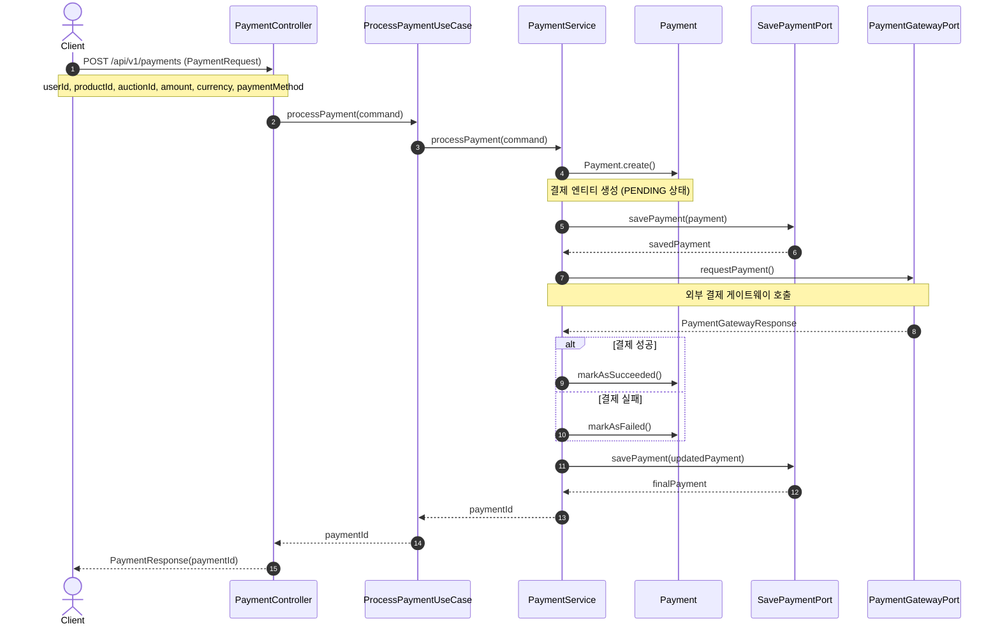

# 결제 처리 시퀀스 다이어그램

결제 처리 과정에 대한 비즈니스 로직 시퀀스 다이어그램입니다.

## 결제 처리 흐름 설명

1. 클라이언트가 결제 요청 데이터(userId, productId, auctionId, amount, currency, paymentMethod)를 포함하여 POST 요청을 전송합니다.

2. PaymentController는 요청을 받아 ProcessPaymentCommand 객체를 생성하고 ProcessPaymentUseCase를 호출합니다.

3. PaymentService는 Payment 도메인 엔티티를 생성합니다:
   - 결제 상태는 PENDING으로 설정됩니다.
   - 생성 시간과 업데이트 시간이 기록됩니다.

4. 생성된 결제 엔티티를 DB에 저장합니다(SavePaymentPort).

5. 외부 결제 게이트웨이에 실제 결제 요청을 전송합니다(PaymentGatewayPort).

6. 결제 게이트웨이 응답에 따라:
   - 성공 시: 결제 상태를 SUCCEEDED로 변경
   - 실패 시: 결제 상태를 FAILED로 변경

7. 업데이트된 결제 정보를 DB에 저장합니다.

8. 결제 ID를 반환하여 클라이언트에 응답합니다.

## 헥사고날 아키텍처 구성요소

- **인바운드 어댑터**: PaymentController
- **인바운드 포트**: ProcessPaymentUseCase (인터페이스)
- **애플리케이션 서비스**: PaymentService (UseCase 구현체)
- **도메인 모델**: Payment (비즈니스 로직 포함)
- **아웃바운드 포트**: SavePaymentPort, PaymentGatewayPort
- **아웃바운드 어댑터**: 각 포트 구현체 (PaymentPersistenceAdapter, PaymentGatewayAdapter) 